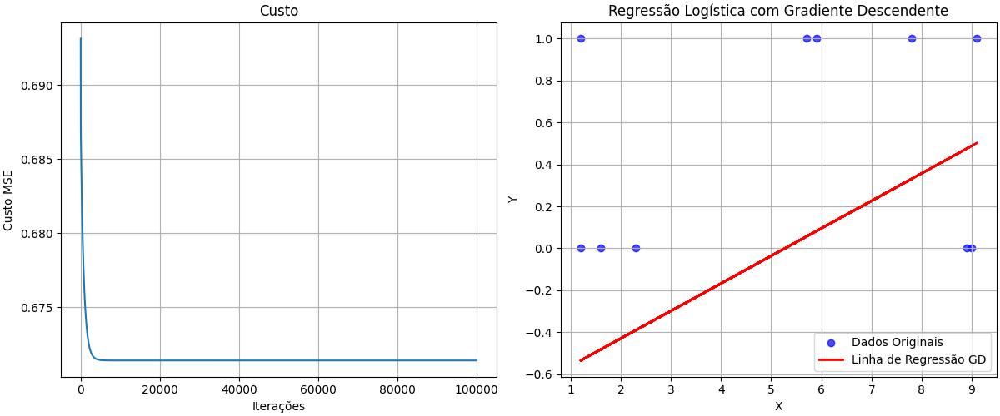
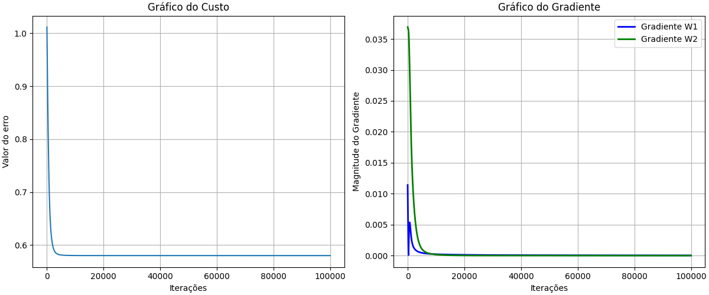

# Neural network
<h1>A study folder on Neural Networks</h1>
<h2>Contents learned</h2>

Here are the completed projects:

<ul>
<li>Gradient_descendent.py</li>
<li>Neuron.py</li>
<li>Neuron2.py</li>
</ul>

<h2>Gradient_descendent.py</h2>

This project presents a simple calculation of the cost and gradient descent. See the graph image:

Link to code: <a href="https://github.com/Gui-coder-alpha/Neural-network/blob/main/Basics/Gradient_descendent.py">Gradient_descendent.py</a>

<h2>Neuron.py</h2>

This project is a simple neuron that has 1 input and 1 output, it only has 1 single neuron. It uses cost calculation and gradient descent, along with object-oriented programming (OOP).. See the graph image:

Link to code: <a href="https://github.com/Gui-coder-alpha/Neural-network/blob/main/Basics/Neuron.py">Neuron.py</a>

<h2>Neuron2.py</h2>

This project features the implementation of hidden layers. In total, it has 3 inputs, 3 outputs, and 2 hidden layer neurons, totaling 5 neurons, which apply non-linearity. It also presents random data, generating different graphs. See the graph image:

Graph 1

Graph 2

Link to code: <a href="https://github.com/Gui-coder-alpha/Neural-network/blob/main/Basics/Neuron2.py">Neuron2.py</a>
