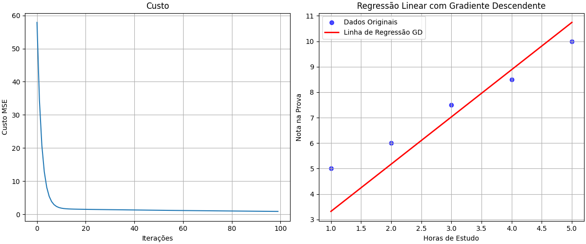

# Neural network
<h1>A study folder on Neural Networks</h1>
<h2>Contents learned</h2>

Here are the completed projects:

<ul>
<li>Gradient_descendent.py</li>
<li>Neuron.py</li>
<li>Neuron2.py</li>
</ul>

<h2>Gradient_descendent.py</h2>

This project presents a simple calculation of the cost and gradient descent. See the graph image:

<h2>Neuron.py</h2>

. See the graph image:

<h2>Neuron.py</h2>

. See the graph image:

